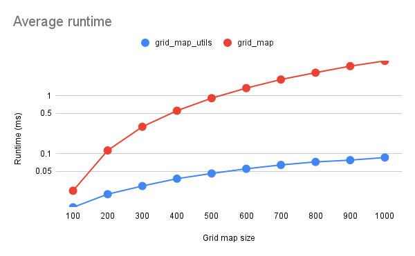

# グリッドマップユーティリティ

## 概要

このパッケージには、ポリゴン内にあるグリッドマップのすべてのセルを反復処理するために使用される `grid_map::PolygonIterator` の再実装が含まれます。

## アルゴリズム

この実装では、ラスタライズされた画像にポリゴンを描画するために使用される一般的なアルゴリズムである [走査線アルゴリズム](https://ja.wikipedia.org/wiki/%E8%B5%B0%E6%9F%A5%E7%B7%9A%E3%82%A2%E3%83%AB%E3%82%B4%E3%83%AA%E3%82%B6%E3%83%B3) を使用します。
このアルゴリズムをグリッドマップに適用した主な考え方は次のとおりです。

- グリッドマップの行とポリゴン端の交点を計算します。
- 各行について、各交点のペア間の列を計算します。
- 結果の `(行、列)` インデックスはポリゴン内にあります。

走査線アルゴリズムの詳細については、リファレンスを参照してください。

## API

`autoware::grid_map_utils::PolygonIterator` は、元の [`grid_map::PolygonIterator`](https://docs.ros.org/en/kinetic/api/grid_map_core/html/classgrid__map_1_1PolygonIterator.html) と同じ API に従います。

## 前提

`autoware::grid_map_utils::PolygonIterator` の動作が `grid_map::PolygonIterator` と一致するのは、ポリゴンの端がどのセルの中心とも _完全に_ 交差しない場合のみです。
このような場合、交差したセルがポリゴンの内側と外側のどちらと見なされるかは、浮動小数点の精度誤差によって異なる場合があります。

## パフォーマンス

`test/benchmarking.cpp` にベンチマークコードを実装しており、`autoware::grid_map_utils::PolygonIterator` が `grid_map::PolygonIterator` とまったく同じように動作することを検証するためにも使用しています。

次の図は、このパッケージ (`autoware_grid_map_utils`) の実装と元の (`grid_map`) 実装のランタイムを比較したものです。
測定した時間は、イテレータの構築とすべてのインデックスの反復処理を含み、対数スケールで示しています。
結果は、側辺長が `100 <= n <= 1000` の正方形グリッドマップ (サイズ=`n` は、`n x n` セルのグリッドを表します) で、頂点数が `3 <= m <= 100` のランダムなポリゴンでばらつきがあり、各パラメーター `(n,m)` は 10 回繰り返して取得されました。

## 今後改善予定

複数のポリゴンに対する走査線アルゴリズムのバリエーションがあります。
これらは、複数のポリゴンのいずれかに含まれるセルを反復処理する場合に実装できます。

現在の実装は、中心点がポリゴン内にある場合にセルが選択される、元の `grid_map::PolygonIterator` の動作を模倣しています。
例えば、この動作は、ポリゴンに重なるセルのみを返すように変更できます。

## 参考資料

- <https://ja.wikipedia.org/wiki/%E8%B5%B0%E6%9F%A5%E7%B7%9A%E3%82%A2%E3%83%AB%E3%82%B4%E3%83%AA%E3%82%B6%E3%83%B3>
- <https://web.cs.ucdavis.edu/~ma/ECS175_S00/Notes/0411_b.pdf>

