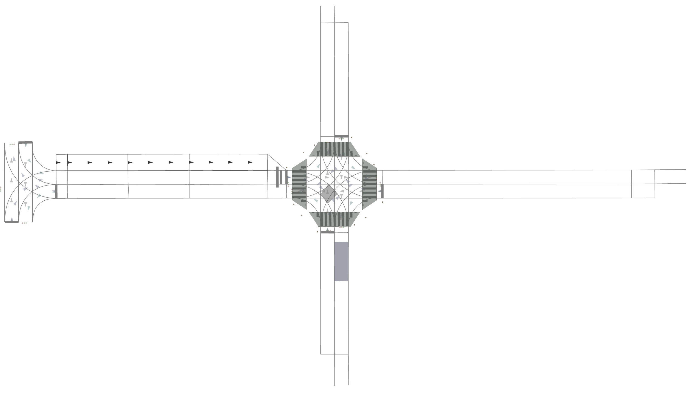

# テストユーティリティ

## 背景

Autowareのいくつかのコンポーネント・モジュールに既に単体テストが導入されており、単体テストの記述プロセスを容易にする共通ライブラリが必要です。

## 目的

`test_utils`の目的は、Autowareコンポーネント用の単体テストライブラリの開発です。このライブラリには以下が含まれます。

- 一般的に使用される関数
- 入力/モックデータパーサー
- テスト用のマップ
- 一般的な経路およびテスト用モックデータ

## 利用可能なマップ

次のマップは[こちら](https://github.com/autowarefoundation/autoware.universe/tree/main/common/autoware_test_utils/test_map)で利用できます。

### Common

共通マップには、肩レーン、交差点、いくつかの規制要素など、使用可能なさまざまなタイプの入力が含まれています。共通マップはフォルダー内で`lanelet2_map.osm`という名前です。



### 2 km Straight

2 km直線レーンレットマップは、同じ方向に走る2つの車線で構成されています。マップは`2km_test.osm`という名前です。


以下にマップの設計を示します。


### road_shoulders

road_shouldersレーンレットマップは、次のようなroad_shoulderタグが付いたさまざまなピックアップ/ドロップオフサイトマップで構成されています。

- 側道車線の横にあるピックアップ/ドロップオフサイト
- 曲線車線の横にあるピックアップ/ドロップオフサイト
- 私有区域内のピックアップ/ドロップオフサイト


planning_simulatorを次のように簡単に起動できます。


```bash
ros2 launch autoware_test_utils psim_road_shoulder.launch.xml vehicle_model:=<> sensor_model:=<> use_sim_time:=true
```

### 交差点

交差点のレーンレットマップには、以下を含むさまざまな交差点があります。

- 交通信号機付き4車線交差点
- 交通信号機のない4車線交差点
- 交通信号機のないT字路交差点
- ループのある交差点
- 複雑な交差点


次のようにして簡単にplanning_simulatorを起動できます


```bash
ros2 launch autoware_test_utils psim_intersection.launch.xml vehicle_model:=<> sensor_model:=<> use_sim_time:=true
```

## 使用例

### Autoware Planning Test Manager

[Autoware Planning Test Manager](https://autowarefoundation.github.io/autoware.universe/main/planning/autoware_planning_test_manager/)の目標は、Planningモジュールノードをテストすることです。 `PlanningInterfaceTestManager`クラス([ソースコード](https://github.com/autowarefoundation/autoware.universe/blob/main/planning/autoware_planning_test_manager/src/autoware_planning_test_manager.cpp))は、`test_utils`関数をベースにラッパー関数を生成します。

### 単体テスト用のテストデータ生成

[PR説明](https://github.com/autowarefoundation/autoware.universe/pull/9207)で提示されているように、ユーザーはテストマップ上でPlanning Simulationを実行中にシーンのスナップショットをyamlファイルに保存することができます。


```bash
ros2 launch autoware_test_utils psim_road_shoulder.launch.xml vehicle_model:=<vehicle-model> sensor_model:=<sensor-model>
ros2 launch autoware_test_utils psim_intersection.launch.xml vehicle_model:=<vehicle-model> sensor_model:=<sensor-model>
```


```bash
ros2 service call /autoware_test_utils/topic_snapshot_saver std_srvs/srv/Empty \{\}
```

トピックを保存するトピックのリストとフィールド名は、`config/sample_topic_snapshot.yaml` で指定されています。


```yaml
# setting
fields:
  - name: self_odometry # this is the field name for this topic
    type: Odometry # the abbreviated type name of this topic
    topic: /localization/kinematic_state # the name of this topic

# output
self_odometry:
  - header: ...
    ...
```

各フィールドは、`autoware_test_utils/mock_data_parser.hpp` で定義された関数を使用して ROS メッセージタイプに解析できます。

