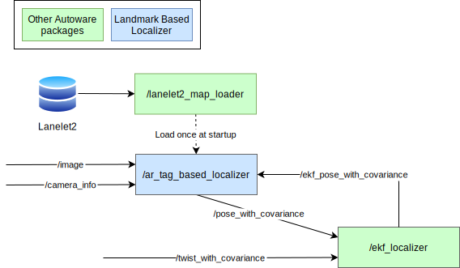

# ランドマークベースの局在化

このディレクトリにはランドマークベースの局在化用のパッケージが含まれています。

たとえばランドマークには次のものがあります。

- カメラで検出されたARタグ
- LiDARで検出された強度によって特徴付けられたボード

など

これらのランドマークは検出と推定の姿勢が容易であるため、ランドマークの姿勢が事前にマップに記載されている場合、検出されたランドマークの姿勢から自己姿勢を計算できます。

現在、ランドマークは平面であると想定されています。

次の図は、`ar_tag_based_localizer` の場合の局在化の原理を示しています。

この計算された自己姿勢はEKFに渡され、ねじれ情報と融合されてより正確な自己姿勢を推定するために使用されます。

## ノード図

### `landmark_manager`

マップに書き込まれたランドマークの定義については、次のセクションの「マップ仕様」を参照してください。

`landmark_manager` はマップからランドマークを読み込むためのユーティリティパッケージです。

- 並進: ランドマークの4つの頂点の中心
- 回転: 頂点番号を次のセクションで示すように反時計回りに1、2、3、4とします。方向は、1から2へのベクトルと、2から3へのベクトルの外積として定義されます。

ユーザーはランドマークをLanelet2の4頂点ポリゴンとして定義できます。
この場合、4つの頂点が同じ平面にあるとは見なせない配置を定義できます。その場合のランドマークの方向は計算が困難です。
したがって、4つの頂点を四面体として形成し、その体積が`volume_threshold` パラメーターを超えると、ランドマークはtf_staticをパブリッシュしません。

### ランドマークベースの局在化パッケージ

- ar_tag_based_localizer
- など

## マップ仕様

<https://github.com/autowarefoundation/autoware_lanelet2_extension/blob/main/autoware_lanelet2_extension/docs/lanelet2_format_extension.md#localization-landmarks>を参照してください。

## `consider_orientation` について

`LandmarkManager` クラスの`calculate_new_self_pose` 関数は、`consider_orientation` という名前のブーリアン引数を含みます。この引数は、検出されたランドマークとマッピングされたランドマークに基づいて新しい自己姿勢を計算するために使用される手法を決定します。次の画像は、2つの方法の違いを示します。

### `consider_orientation = true`

このモードでは、新しい自己姿勢は、「現在位置から検出されたランドマーク」の相対姿勢が「新しい自己姿勢からマッピングされたランドマーク」の相対姿勢と等しくなるように計算されます。
この方法は、向きを補正できますが、ランドマーク検出の向き誤差の影響を強く受けます。

### `consider_orientation = false`

このモードでは、x、y、z の相対位置だけが正しいように、新しい自車位置を計算します。

この手法では、方位の補正は行えませんが、マーカー検出の方位誤差の影響を受けません。

