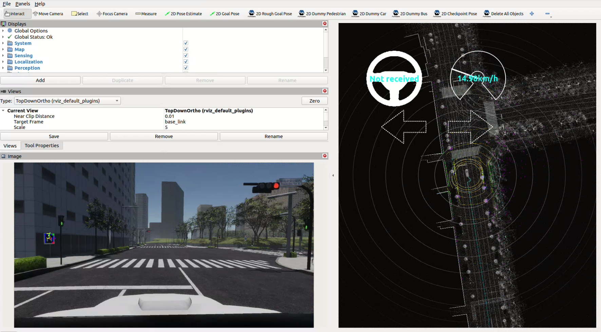

# AR Tagベースのローカライザ

**ArTagBasedLocalizer** はビジョンベースのローカリゼーションノードです。


このノードは [ArUcoライブラリ](https://index.ros.org/p/aruco/) を使用してカメラ画像からARタグを検出し、この検出に基づいて自車位置を計算してパブリッシュします。
ARタグの位置と向きは、Lanelet2フォーマットで記述されているものと想定されます。

## 入出力

### `ar_tag_based_localizer` ノード

#### 入力

| 名                   | 型                                            | 説明                                                                                                                                                                                                                                                               |
| :--------------------- | :---------------------------------------------- | :------------------------------------------------------------------------------------------------------------------------------------------------------------------------------------------------------------------------------------------------------------------------ |
| `~/input/lanelet2_map` | `autoware_map_msgs::msg::LaneletMapBin`         | Lanelet 2データ                                                                                                                                                                                                                                                          |
| `~/input/image`        | `sensor_msgs::msg::Image`                       | カメラ画像                                                                                                                                                                                                                                                              |
| `~/input/camera_info`  | `sensor_msgs::msg::CameraInfo`                  | カメラ情報                                                                                                                                                                                                                                                               |
| `~/input/ekf_pose`     | `geometry_msgs::msg::PoseWithCovarianceStamped` | IMU補正なしのEKF推定値。誤検知のフィルタリングに使用され、検出したARタグの妥当性を評価します。EKF推定値とARタグで検出した推定値が一定の時間と空間範囲内にある場合のみ、検出したARタグの推定値は有効と見なされ、パブリッシュされます。 |

#### 出力

**自動運転ソフトウェア仕様**

**1. 概要**

このドキュメントでは、自律走行車両向けのオープンソース自動運転ソフトウェア「Autoware」について説明します。 Autowareは、安全かつ効率的な自律走行実現に必要なモジュール群を提供するモジュールベースのソフトウェアプラットフォームです。

**2. コンポーネント**

**2.1 Perception（感知）モジュール**

* カメラ、レーダー、LiDARなどのセンサーからのデータを処理し、周囲環境の3Dマップを作成します。
* 交通標識、歩行者、障害物などのオブジェクトを検出し、追跡します。

**2.2 Localization（自己位置推定）モジュール**

* GNSS、IMU、車輪エンコーダーなどのセンサーデータを処理し、自車位置を推定します。
* スラム（SLAM）アルゴリズムを使用して、周囲環境の地図を作成・更新します。

**2.3 Planning（計画）モジュール**

* 感知モジュールからのオブジェクト情報を基に、車両の経路と速度計画を生成します。
* 障害物回避、レーンキープなどの計画を実行するコントローラーを提供します。

**2.4 Behavior Planning（挙動計画）モジュール**

* 交通規則を遵守するための車両挙動を生成します。
* 自動運転レベルに応じた異なる挙動をサポートしています。

**2.5 Control（制御）モジュール**

* 計画モジュールからのコマンドに基づいて、車両のステアリング、ブレーキ、アクセルを制御します。
* 縦方向、横方向の制御のためのコントローラーを提供します。

**3. 安全機能**

Autowareには、次の安全機能が組み込まれています。

* **衝突回避システム:** 障害物との衝突を回避するための緊急回避策を実行します。
* **速度逸脱量管理:** 設定された速度制限を超えた場合に警告を発し、車両を減速します。
* **加速度逸脱量管理:** 快適さと安全性を確保するための急加速度や急減速を防止します。
* **車両制御の監視:** 制御モジュールの動作を監視し、異常が発生した場合に車両を停止させます。

**4. データ処理パイプライン**

Autowareのデータ処理パイプラインは、次の手順に従います。

* **センサーデータの取得:** センサーから生のデータを収集します。
* **'post resampling'によるデータフィルタリング:** ノイズや不要なデータを除去します。
* **オブジェクト検出と追跡:** 感知モジュールがオブジェクトの検出と追跡を実行します。
* **自己位置推定:** 自己位置推定モジュールが自車位置を推定します。
* **経路計画:** 計画モジュールが経路と速度計画を生成します。
* **挙動計画:** 挙動計画モジュールが車両挙動を生成します。
* **制御:** 制御モジュールが車両の制御を実行します。

**5. インターフェース**

Autowareは、ROS（Robot Operating System）上で動作します。 ROSノードを使用して、モジュール間でのデータのやり取りと通信を行います。

**6. 開発とサポート**

Autowareはオープンソースプロジェクトであり、誰でも貢献できます。 Autowareコミュニティは、ドキュメント、フォーラム、サポートでユーザーをサポートしています。

| 名称                                | タイプ                                                            | 説明                                                                  |
| :--------------------------------- | :--------------------------------------------------------------- | :------------------------------------------------------------------------- |
| `~/output/pose_with_covariance`      | `geometry_msgs::msg::PoseWithCovarianceStamped`      | 推定姿勢                                                               |
| `~/debug/result`                      | `sensor_msgs::msg::Image`                                   | [デバッグトピック] マーカー検出結果が、入力画像に重ね書きされた画像 |
| `~/debug/marker`                      | `visualization_msgs::msg::MarkerArray`                        | [デバッグトピック] Rviz内で薄い板として可視化するロード済ランドマーク |
| `/tf`                                  | `geometry_msgs::msg::TransformStamped`                        | カメラから検出されたタグまでのトランスフォーム                        |
| `/diagnostics`                        | `diagnostic_msgs::msg::DiagnosticArray`                       | 診断結果                                                               |

## パラメータ

{{ json_to_markdown("localization/autoware_landmark_based_localizer/autoware_ar_tag_based_localizer/schema/ar_tag_based_localizer.schema.json") }}

## 起動方法

Autowareを起動する際、`artag` を `pose_source` に設定します。


```bash
ros2 launch autoware_launch ... \
    pose_source:=artag \
    ...
```

### Rosbag

#### [サンプル rosbag とマップ (AWSIM データ)](https://drive.google.com/file/d/1ZPsfDvOXFrMxtx7fb1W5sOXdAK1e71hY/view)

このデータは [AWSIM](https://tier4.github.io/AWSIM/) で作成されたシミュレーション データです。
本質的に、AR タグベースの自己位置推定は公共道路の運転ではなく、より狭いエリアでの運転を意図しているため、最高運転速度は時速 15km に設定されています。

各 AR タグが検出され始めるタイミングによって、推定に大きな変化が生じることは既知の問題です。



#### [サンプル rosbag とマップ (実世界データ)](https://drive.google.com/file/d/1VQCQ_qiEZpCMI3-z6SNs__zJ-4HJFQjx/view)

トピック名を再マッピングし、実行してください。


```bash
ros2 bag play /path/to/ar_tag_based_localizer_sample_bag/ -r 0.5 -s sqlite3 \
     --remap /sensing/camera/front/image:=/sensing/camera/traffic_light/image_raw \
             /sensing/camera/front/image/info:=/sensing/camera/traffic_light/camera_info
```

このデータセットには、IMU データの欠損などの問題があり、全体的な精度は低いです。AR タグベースの自己位置推定を実行した場合でも、真の軌跡との大きな差が観察されます。

サンプルが実行されてプロットされるときの軌跡を下の画像に示します。


以下のプルリクエストのビデオも参考になります。

<https://github.com/autowarefoundation/autoware.universe/pull/4347#issuecomment-1663155248>

## 原理


