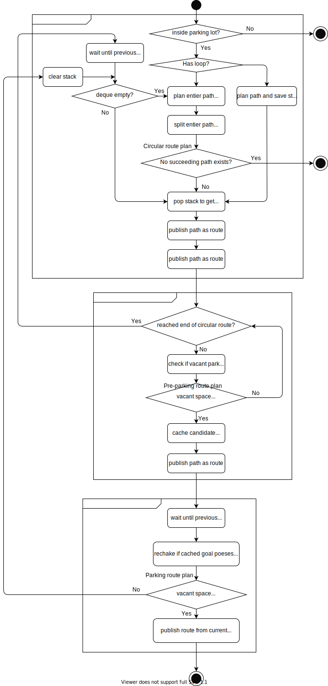

# Auto parking planner

A demo video of the auto parking in planning simulater:
for full instruction, plase see the document below.

https://user-images.githubusercontent.com/38597814/171078936-418b7ace-40e4-4e52-9148-b3ca19096c10.mp4

The original video can be found here (tier4 internal):
https://drive.google.com/file/d/12vGfLPoGXqsztcAAJToqDEV1wgXsJtBH/view?usp=sharing

## Input topics

| Name                      | Type                                       | Description                                                |
| ------------------------- | ------------------------------------------ | ---------------------------------------------------------- |
| `~/input/vector_map`      | autoware_auto_mapping_msgs::HADMapBin      | vector map of Lanelet2                                     |
| `~/input/state`           | autoware_auto_system_msgs::AutowareState   | autoware state                                             |
| `~/input/velocity_report` | autoware_auto_vehicle_msgs::VelocityReport | information on vehicle velocity                            |
| `~/input/trajectory`      | autoware_auto_planning_msgs::Trajectory    | trajectory which will be used to determine lookahead point |

## Service requesting from this node

(To be filled)
| Name | Type | Description |
| -------------------- | --------------------------------------- | ------------------------------------------ |

## Service response from this node

(To be filled)
| Name | Type | Description |
| -------------------- | --------------------------------------- | ------------------------------------------ |

## Node diagram and definition of service


## Flow chart



## How it works

自動駐車では駐車場内を(1)巡回し, (2)駐車可能なスペースを発見し, (3)駐車します. これら 3 つのフェーズに関するプランナをそれぞれ Cicular route planner, Preparking route planner, Parking route planner と呼んでいます. それぞれの planner は`HADMApRoute`を計算し, `autoware_parking_srvs/srv/ParkingMissionPlan.srv`で定義されたサービスを介して, mission planner に route を渡し, 最終的に mission planner が route を publish します. 尚, mission planner を介さず, auto parking planner だけで`HADMapRoute`を publish する方が実装は簡単になるのですが, `HADMapRoute`を publish するのは mission planner だけであってほしいため, 本実装では mission planner を介しています.

注意点としては, Circular, preparking, parking は"プランニングに関する"フェーズであり, 車両の走行フェーズではないということです. 例えば以下のフローチャートの`Parking route plan`内の`wait until previous route finished`のノードは一つ前のフェーズの`Preparking route plan`で計画されたルートの走行が完了するまで待つ処理をしています. このように, parking route plan 内で車両の preparking に対応する走行フェーズが完了待ちがなされており, parking route plan の"プランニングフェーズ"中に preparking の走行フェーズが行われています.

次に各フェーズの詳細を述べます.

### Circular route planning

Circular planning は駐車場内のレーンにループがある場合とない場合で挙動が異なります.

- ループが無い場合は簡単で, 左下図にあるように, 現在地から駐車場の出口までのルートを計画し, stack(1 要素しかない)として保存します.
- ループがある場合(右下図), まず全てのループするレーンを少なくとも一度通るような経路を計画します(図だと, 0 -> 7). 次にこの経路をループが生じないように分割します (赤線: 0 -> 11, 緑線: 11 -> 7). そして分割した経路を stack として保存します. この stack の先頭要素をポップしてルート作成します. フローチャートにもあるように, Prparking や Parking フェーズから Circular フェーズに戻ってくる場合がありますが, この場合 stack の先頭要素をポップしてルート作成します. もし stack が空の場合, 上記のようなループが生じないように分割された経路系列を再計画します. なお, ループがある場合に分割せずに A -> C のルートを作成する方が自然に思えますが, 現行の RouteHandler がループがあるルートを処理できないという制約があるため本実装では上記のような分割処理を行っています.


### Preparking route planning

走行中, 車から lookahead distance だけ離れた場所を(以下 lookahead point) 中心とする探索円内にあるすべての駐車候補地ポーズに関して, 駐車可能かどうかを計算します. lookahead point は`~/input/trajectory`を用いたスプライン補完により計算しています. `input/trajectory`としては例えば`/planning/scenario_planning/trajectory`が適当です.

駐車可能判定は rosparam で`check_only_goal`が`true`の場合はゴール地点がコストマップのコストとオーバーラップがないことを判定基準とします. `check_only_goal`が`false`の場合, lookahead point から駐車候補ポーズまでの実行可能経路が計算可能か否かを判定基準とします. このような駐車候補ポーズの駐車可否判定はプログラム中では`askFeasibleGoalIndex`として実装されており, 内部では FreespacePlanner へのサービスコールにより実現されています.

`askFeasibleGoalIndex`により駐車可能だと判定された駐車候補ポーズは全て, `std::vector<Pose> feasible_parking_goal_poses`のメンバ変数に保存されます. 駐車可能な候補ポーズが 1 つでもあれば, 下図 P1(現在位置)から P2(lookahead point)までのルートを作成し, mission planner に渡して publish してもらいます. これにより新しいゴールが設定されるので自動車は一時停止し, engage をセットすることで自動車は lookahead point に向けて動きはじめます.

駐車可能なポーズが見つかるまで while 文内で`askFeasibleGoalIndex`は呼ばれ続けます. もしも見つからないまま, Circular route planning で publish したルートの終端地点まで到達してしまった場合, 再び Circular route planning に遷移します.


### Parking planning

まず P2(Lookahead point)までの移動が完了するのを待ちます. (wait until previous route finished). 実際には P2 に正確に停車することはできません. そこで実際に停車した位置を P2'とします. 次にすべての`feasible_parking_goal_poses`について再度`askFeasibleGoalIndex`を行い, 駐車可能な駐車ポーズ(P3)が一つでもあれば, P2'から P3 までのルートを作成し, mission planner に渡し publish してもらいます(上図右). もしここで駐車可能な駐車ポーズが一つも無い場合, 再び Circular route planning に遷移します.

## Running on simulation

### installation

(ansible を使った)ros2 等のインストールは完了していることを前提とします.

```bash
git clone git@github.com:tier4/pilot-auto.git
cd pilot-auto
git checkout feature/autoparking
```

あとは, pilot-auto/feature/autoparking の`README.md`を参照してください. (map 等のダウンロードもここで行われます.)

### running (no loop case)

- plannin simulater をたちあげる.
  ros2 launch autoware_launch planning_simulator.launch.xml map_path:=/home/h-ishida/Downloads/sample_map vehicle_model:=lexus sensor_model:=aip_xx1

- autoware の tutorial に書かれている標準的な方法で, planning simulator を起動する.
- parking lot 内のレーンに Ego Vehicle をセットする.
- 以下のサービスコールを行い, auto parking を開始する.

```bash
ros2 service call /planning/mission_planning/service/autopark std_srvs/srv/Trigger
```

- 各プランニングフェーズが終了し, route が publish されるごとに engage が要求されるので browser インターフェースを用いるか, 以下のコマンドを端末に打ち込み engage する.

```bash
ros2 topic pub --once /autoware/engage autoware_auto_vehicle_msgs/msg/Engage "engage: true"
```

### running (loop case)

tutorial の planning simulator の駐車場のルートはループが無い. ループがある環境でテストするためには, osm マップを以下からダウンロードし使用する.
<https://drive.google.com/file/d/1O87YxNXF8apw6qwTZvWGNBx7PiI6AhFv/view?usp=sharing>
このマップは松本さんが作られた tier4 の office2 階のロージー向けの osm マップを, レクサスでも使えるように修正(拡大等)したものである.
