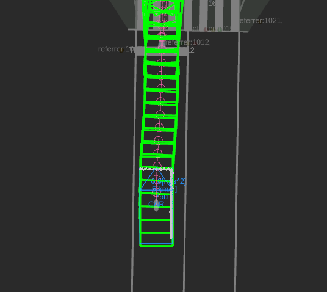
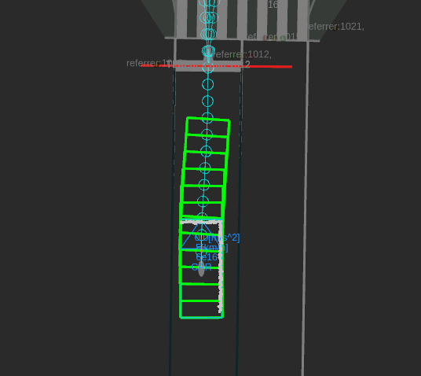
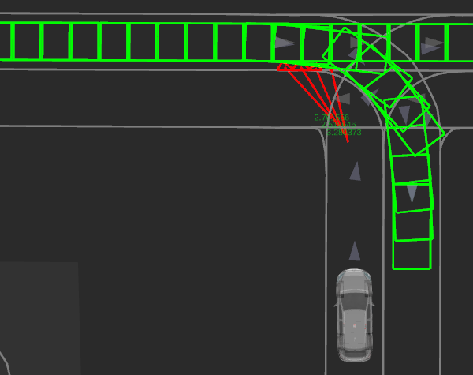
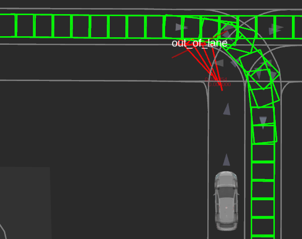

# レーン逸脱

## 役割

自車のフットプリントが車線を逸脱する場合があります。たとえば、大型車両で狭い角を曲がるときです。
`out_of_lane`モジュールは、このような車線逸脱時に衝突が発生しないようにするために、車両軌跡に減速ポイントと停止ポイントを追加します。

## アクティベーション

このモジュールは、起動パラメータ`launch_out_of_lane_module`が`true`に設定されている場合にアクティベートされます。

## 内部動作/アルゴリズム

このモジュールは、車線逸脱衝突が発生するかどうかを計算し、必要に応じて衝突前に停止ポイントを挿入します。

アルゴリズムでは、入力車両軌跡に正確な`time_from_start`値が含まれているものとして、予測オブジェクトとの衝突時刻を正確に計算します。

次に、モジュールの内部動作についてさらに詳しく説明します。

### 1. 車両軌跡フットプリント

この最初のステップでは、車両フットプリントが各軌跡ポイントに投影され、そのサイズは`ego.extra_..._offset`パラメータに基づいて修正されます。

フットプリントの生成に使用される軌跡の長さは、`max_arc_length`パラメータによって制限されます。

### 2. 他のレーンのレレット

2番目のステップでは、衝突を回避する必要があるレーンのレレットを計算します。軌跡のラインストリング（軌跡ポイントのシーケンス）またはその先行するレーンのレレットによって横切られない、車両周辺のすべてのレーンのレレットを考慮します。

デバッグの可視化では、これらの他のレーンのレレットは青い多角形として表示されます。

### 3. 車線逸脱エリア

次に、各軌跡ポイントについて、他のレーンのレレット（ステップ 2 から）を軌跡ポイントのフットプリント（ステップ 1 から）と交差させて、対応する車線逸脱エリアを作成します。
各エリアは、エリアと重なるレーンのレレットと、対応する車両軌跡ポイントに関連付けられています。

デバッグの可視化では、車線逸脱エリアの多角形は、線で対応する軌跡ポイントに接続されています。

### 4. 予測オブジェクトのフィルタリング

オブジェクトとその予測パスは、以下の条件でフィルタリングされます。

- `minimum_velocity`パラメータ以下の速度のオブジェクトは無視します。
- パラメータ`ignore_behind_ego`が`true`に設定されている場合は、自車両の後ろから来るオブジェクトを無視します。
- 信頼度値が`predicted_path_min_confidence`パラメータを下回る予測パスは無視します。
- パラメータ`cut_predicted_paths_beyond_red_lights`が`true`に設定されている場合は、赤信号の停止線を超える予測パスのポイントをカットします。

| `cut_predicted_paths_beyond_red_lights = false` | `cut_predicted_paths_beyond_red_lights = true` |
| :----------------------------------------------------: | :---------------------------------------------------: |
|  |  |

デバッグ可視化では、予測パスは緑、赤信号の停止線は赤で表示されます。

### 5. 衝突までの時間

各車線逸脱領域について、予測パスに基づいて、ダイナミックオブジェクトがその領域と重複するまでの時間を計算します。

パラメータ `mode` が `threshold` に設定され、計算された時間が `threshold.time_threshold` パラメータよりも小さい場合、車線逸脱領域を回避すると判断されます。

パラメータ `mode` が `ttc` に設定されている場合、
オブジェクトの予測時間と、軌跡ポイントに含まれる `time_from_start` フィールドを比較して衝突までの時間を計算します。
衝突までの時間が `ttc.threshold` パラメータ値を下回っている場合、车線逸脱領域の回避が決定されます。

デバッグの可視化では、ttc（秒）が対応する軌跡ポイントの上に表示されます。
衝突を回避する必要がある場合はテキストは赤色、そうでない場合は緑色になります。

### 6. 停止または減速ポイントの計算

まず、車両滑らかさパラメータで設定されたジャークおよび減速の制約に基づいて、自車の最小停止距離を計算します。

次に、軌跡に沿って、自車のフットプリントが自車車線内に留まる最長ポイントを探し、最小停止距離と回避すべき衝突が発生する最初の軌跡ポイント（前の手順で決定）の間に検索範囲を制限します。
検索は、`action.precision` パラメータで設定されたステップ距離で、軌跡に沿って後方に移動することで実行されます。

最初に、この検索を `ego.extra_..._offset`、`action.longitudinal_distance_buffer`、および `action.lateral_distance_buffer` パラメータで拡張されたフットプリントに対して実行します。
有効なポイントが見つからない場合、超オフセットのみを考慮し、距離バッファは考慮せずに再度検索します。
それでも有効なポイントが見つからない場合は、オフセットなしのベースの自車フットプリントを使用します。
ポイントが見つからない場合は、車線逸脱の有無にかかわらず、衝突が検出される前のポイントを使用します。

減速するか停止するかを決定するのは、自車と回避する必要がある軌跡ポイントとの距離です。
この距離が `actions.slowdown.threshold` を下回ると、`actions.slowdown.velocity` の速度が使用されます。
距離が `actions.stop.threshold` を下回ると、`0` m/s の速度が使用されます。

### 停止/減速ポイントの安定性について

入力軌跡は反復間で大幅に変更される可能性があるため、このモジュールの決定も変更されることが想定されます。
決定をより安定させるため、停止または減速ポイントは `action.min_duration` パラメータで設定された最小時間使用されます。
その間に自車に近い新しいポイントが生成された場合、古いポイントと置き換えられます。
それ以外の場合は、設定された時間の間、車線逸脱の衝突が検出されない場合にのみ、停止または減速ポイントは破棄されます。

## モジュールパラメータ

| パラメータ | 型 | 説明 |
| ---------------- | ---- | ---------------------------------------- |
| `mode` | 文字列 | 動的対象の考慮に使用するモード。候補: threshold, intervals, ttc |
| `skip_if_already_overlapping` | ブール値 | 真の場合、自車が既に他の車線と重複している場合、このモジュールを実行しない |
| `max_arc_length` | double | 車線逸脱衝突の確認に使用される最大軌跡弧長 |

| パラメータ/しきい値 | 型   | 説明                                                           |
| -------------------- | ------ | ---------------------------------------------------------------- |
| `time_threshold`     | double | [s] この時間内に重なりが生じる可能性のあるオブジェクトを考慮する |

| Parameter /ttc | Type   | Description                                                                                           |
| -------------- | ------ | ----------------------------------------------------------------------------------------------------- |
| `threshold`    | double | egoが重なっている間に、この値よりも推定衝突時間（TTC）が短いオブジェクトを考慮します。 |

| パラメータ / オブジェクト | データ型 | 説明 |
|---|---|---|
| `minimum_velocity` | double | [m/s] この値以下の速度のオブジェクトを無視 |
| `predicted_path_min_confidence` | double | [-] 予測パスが有効と見なされるための最小信頼度 |
| `cut_predicted_paths_beyond_red_lights` | bool | [-] trueの場合、赤信号の停止線の向こう側の予測パスは切断 |
| `ignore_behind_ego` | bool | [-] trueの場合、自車後方のオブジェクトは無視 |

| パラメータ/アクション             | タイプ | 説明                                                                     |
| -------------------------------- | ------ | ------------------------------------------------------------------------ |
| `precision`                     | double | 停止点を軌跡に挿入するときの[m]精度                                     |
| `longitudinal_distance_buffer` | double | 自車の前方に保持する[m]の安全距離バッファ                                 |
| `lateral_distance_buffer`      | double | 自車の側面に保持する[m]の安全距離バッファ                                 |
| `min_duration`                 | double | 決定をキャンセルできるようになるまでに必要な[s]の最小継続時間           |
| `slowdown.distance_threshold`  | double | オーバーラップからこの距離よりも近づいたときに減速を挿入する               |
| `slowdown.velocity`            | double | 減速速度                                                                 |
| `stop.distance_threshold`      | double | オーバーラップからこの距離よりも近づいたときに停止を挿入する              |

| パラメータ/自車 | タイプ | 説明 |
| ---------------- | ----- | ---------------------------------------------------- |
| `extra_front_offset` | double | 自車フットプリントに追加する前方距離[m] |
| `extra_rear_offset`  | double | 自車フットプリントに追加する後方距離[m]  |
| `extra_left_offset`  | double | 自車フットプリントに追加する左側距離[m]  |
| `extra_right_offset` | double | 自車フットプリントに追加する右側距離[m] |

